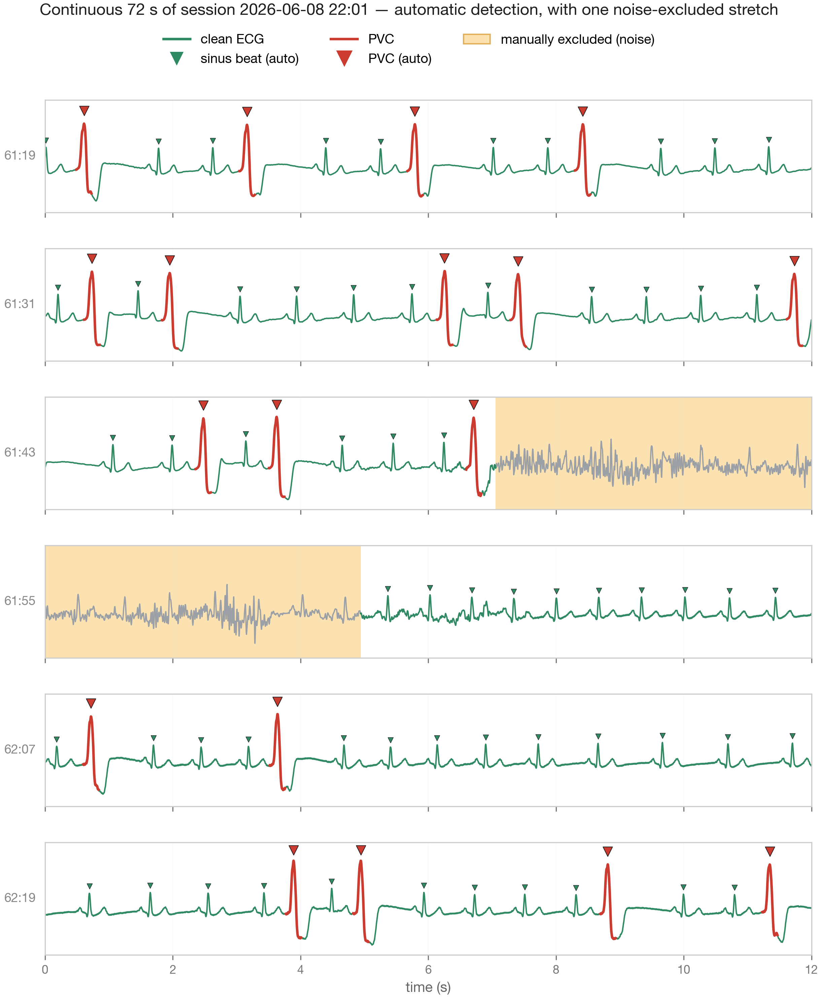
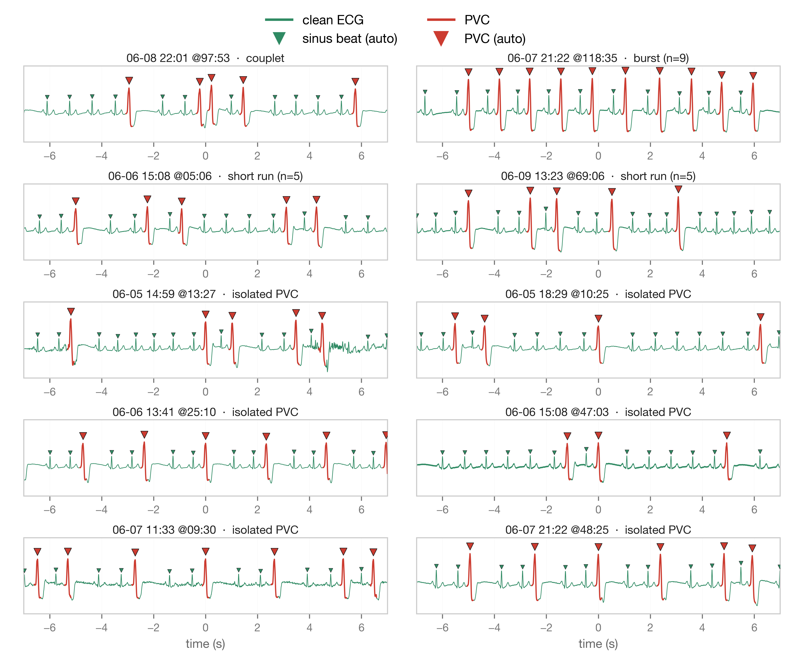
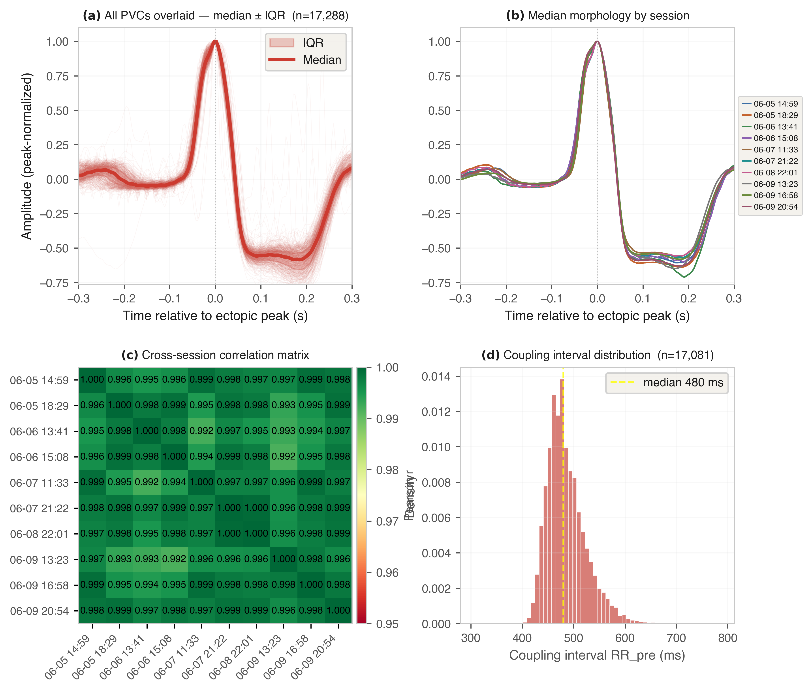
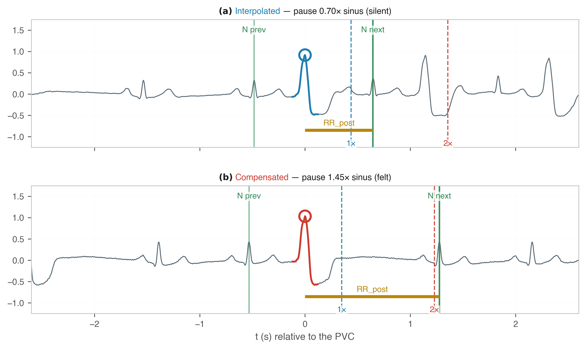
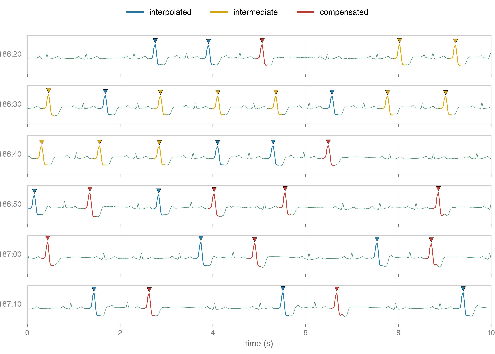
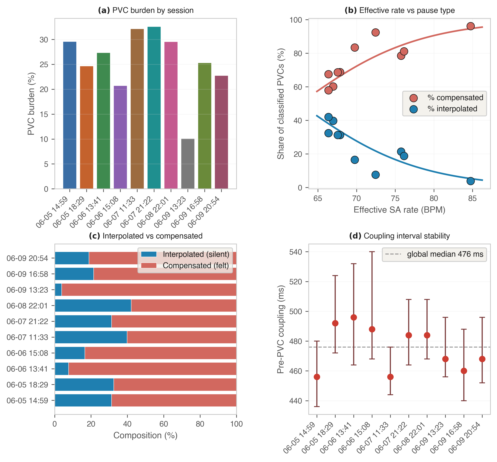
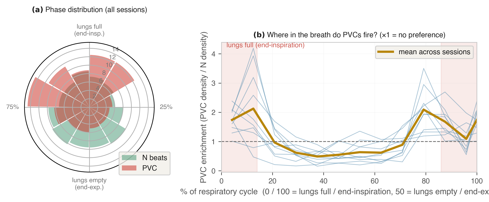

# DIY Single-Lead Holter ECG

[](https://github.com/mrEg0n/holter-ecg/actions/workflows/ci.yml)

> ⚠️ **Disclaimer.** A hobbyist, home-built project for engineering and signal-analysis purposes
> only. **Not a medical device** — not clinically validated or certified, not a medical record, not a
> clinical Holter report, and not diagnostic. Any cardiac condition should be evaluated by qualified
> professionals using clinically validated tools.

A hobbyist, low-cost, home-built single-lead ECG recorder and analysis pipeline for
long-duration exploratory recordings of premature ventricular complexes (PVCs).

This project combines a compact ECG acquisition unit, real-time wireless streaming, a
browser-based monitoring dashboard, manual annotation tools, automated beat detection,
rule-based PVC classification, noise curation, and downstream report generation.

It was developed as an engineering and signal-analysis exercise on personal ECG recordings.



*Continuous single-lead ECG (72 s, in consecutive 12-second rows). Beats are detected and classified
automatically — teal = sinus, red = PVC; shaded spans are intervals manually excluded as motion/contact
noise before analysis.*

[](reports/holter_report.pdf)

The report is a longitudinal single-subject study of ~17,000
PVCs across 10 sessions: morphology, interpolated vs. compensated beats, couplets, cross-session burden
dynamics, and ECG-derived respiration, generated end-to-end by the pipeline in this repo.

---

## Project overview

The system is built around a single-lead ECG recorder based on an AD8232 biopotential front-end and a
Raspberry Pi Pico 2 W. The recorder streams ECG data to a host computer, currently a MacBook, where a
Python application receives, stores, displays, and processes the signal.

The live ECG trace is served through a Flask dashboard using Server-Sent Events. The dashboard can be
opened on the host computer or on a smartphone connected to the same network, allowing the signal to
be followed in real time during acquisition.

The software pipeline supports:

- real-time ECG acquisition and storage;
- browser-based live monitoring;
- time-stamped manual annotations;
- online signal filtering;
- automatic QRS detection;
- rule-based PVC classification;
- manual exclusion of noisy intervals;
- generation of figures, tables, and HTML/PDF reports from stored recordings.

---

## Hardware

| Component | Notes |
| --- | --- |
| Raspberry Pi Pico 2 W (WH) | RP2350, Wi-Fi, 12-bit ADC. WH = pre-soldered headers. |
| AD8232 breakout board | Any clone of the SparkFun reference design. Includes a 3.5 mm jack for the electrode cable. |
| 3-lead ECG cable (3.5 mm TRS → snap) | Usually included in AD8232 kits. |
| Disposable gel ECG electrodes ×3 | Standard adhesive snap electrodes (3M Red Dot or equivalent). |
| LiPo 3.7 V + TP4056 USB-C charger | For wireless / portable operation. A USB power bank also works. |
| SPDT power switch | On/off for battery operation. |
| Micro-USB cable | For programming and the tethered host link. |

Sampling uses the Pico's internal 12-bit ADC at **250 Hz**. Data is streamed over Wi-Fi, with USB
serial available when tethered. The current build is compact, battery-powered, and wireless, but not
yet housed in a dedicated enclosure. (Photographs of the assembled unit are in the report, Appendix A.)

### Wiring (3 wires)

With the Pico 2 W held USB-up, the AD8232 connects to the **right column** of the Pico header:

| AD8232 pin | Pico 2 W pin (physical) | Function |
| --- | --- | --- |
| `3.3V` | pin 36 (`3V3 OUT`) | Power |
| `GND` | pin 38 (`GND`) | Ground |
| `OUTPUT` | pin 31 (`GP26 / ADC0`) | ECG analog signal |

The electrode jack on the AD8232 takes the snap cable; `LO+`, `LO-`, and `SDN` are not used in the
simplest configuration.

**Electrode placement** (Einthoven Lead I, simplest 3-electrode setup):

```
                ── neck ──
       RA •                  • LA
      (red)                 (yellow)
   below R clavicle    below L clavicle

   ┌──────── chest ────────┐
   │                       │
   │      • RL/N           │
   │     (green)           │
   │   right lower flank   │
   └───────────────────────┘
```

> ⚠️ Always run the Pico from a **battery** (LiPo or USB power bank) when electrodes are attached.
> Never connect a body to a device plugged into mains-powered USB — leakage current is a real safety
> concern even at hobbyist power levels.

### Signal path

```
[3 electrodes] → [AD8232 AFE] → analog ECG (0–3.3 V, centered ~1.55 V)
                                       │
                                       ▼
                            [Pico 2 W ADC0 @ 250 Hz]
                                       │
                           Wi-Fi stream  (USB serial when tethered)
                                       │
                                       ▼
                              [host: Python + Flask]
                  band-pass IIR → state-machine detector → classify
                       → live dashboard + stored recording
```

---

## Current implementation and planned upgrades

In the current version, the Raspberry Pi Pico 2 W acquires the ECG signal and streams it to an
external host, which stores the recording and serves the live dashboard. At this stage the recorder
does **not** store data locally, so the host must remain available and within range during acquisition.

**Roadmap / planned upgrades:**

- **Onboard storage** via a 3 V microSD breakout (Adafruit 4682) over SPI. A 32 GB card would hold
  months of recordings, allowing fully standalone sessions while the Wi-Fi stream stays available for
  live monitoring (including from a smartphone on the same network).
- **Dual ADXL345 accelerometers** (sternum + abdomen) to estimate posture and thoraco-abdominal
  movement, providing context on body position and respiration.
- **Pan–Tompkins-style detection stage** — a dedicated 5–15 Hz QRS-enhancement path for the detector
  (kept separate from the wider display band), to reduce dependence on the absolute amplitude threshold.
- **HRV metrics** (SDNN, RMSSD, pNN50) and a finer PAC-vs-PVC distinction; eventually a 3D-printed
  wearable enclosure.

---

## Software architecture

The stack is Python on the host side and MicroPython on the recorder side. The host-side application:

1. receives the ECG stream from the recorder;
2. stores the incoming signal as a time-stamped recording;
3. serves the live ECG trace through a Flask dashboard (Server-Sent Events);
4. allows manual event annotations during recording;
5. applies signal-processing and beat-detection routines;
6. supports manual noise curation;
7. regenerates full reports from stored data.

Manual annotations can mark events such as meals, caffeine intake, physical exertion, posture changes,
symptoms, or other experimental notes. They remain aligned with the ECG trace during later analysis.

### Signal processing

The incoming ECG is band-pass filtered online with a first-order IIR filter (high-pass 0.3 Hz,
low-pass 25 Hz), sampled at 250 Hz. QRS complexes are detected by a custom four-state finite-state
machine with a 300 ms refractory period:

```
   IDLE ──(v > WIDTH_THR)──▶ WIDTH ──(v > DETECT_THR)──▶ DETECT
     ▲                          │                          │
     │            (v drops, DETECT_THR not crossed)        │
     │                          ▼                          │
     │                        IDLE                         │
     └────────────────── POST ◀──(v < WIDTH_THR)───────────┘
              (monitor the trough for ~200 ms, then classify)
```

Each detected beat is then labelled sinus or ectopic by a fixed rule-based classifier. PVC candidates
are identified from QRS width, post-QRS rebound (`|trough| / peak`), signal amplitude, and a
physiologically plausible duration range. A beat is flagged as a PVC when its rebound ratio or its
width clears the threshold; the same thresholds are applied unchanged across all analysed sessions.

No template matching or model training is used. On a representative recording the features separate
cleanly:

| Feature | Normal beats (median) | PVCs (median) |
| --- | --- | --- |
| QRS width | ~32 ms | ~96 ms |
| Rebound ratio | ~0.25 | ~0.59 |
| Amplitude | ~0.50 V | ~1.15 V |

These thresholds were tuned on a single subject and should not be assumed to transfer unchanged to
other subjects, electrode placements, or acquisition geometries.

### Manual noise curation

Motion artefacts and poor electrode contact produce segments unsuitable for analysis. A paginated
Matplotlib editor lets noisy intervals be marked by hand and stored as per-session exclusion files
(`exclusions/`). Beats inside excluded intervals are removed before any downstream analysis, so
corrupted segments do not contribute to figures, tables, or summaries.

### Report generation

Re-running the pipeline regenerates the **data-derived** parts of the report — every figure, table, and
numerical summary — directly from the stored recordings. Adding a new session and re-running updates all
of them coherently, which keeps the analysis reproducible and provides a transparent record of each
processing step:

```bash
python3 host/dashboard.py      # recompute → reports/holter_dashboard.html (with figures)
python3 host/export_latex.py   # HTML → reports/figs/*.png + reports/tables.tex
latexmk -pdf reports/holter_report.tex   # → reports/holter_report.pdf
```

The regenerated material includes: session overview, beat counts, PVC burden, noise-exclusion summary,
PVC morphology, interpolated vs. compensated classification, couplet detection, cross-session rhythm
metrics, ECG-derived respiration, and per-session appendices.

**What is automated, and what is not.** The tooling regenerates only the figures, tables, and numbers
computed from the data, keeping them in sync with the recordings. The written analysis, interpretation,
and conclusions live in the LaTeX source (`reports/holter_report.tex`), are authored by hand, and are
never generated or rewritten automatically. The pipeline keeps the *evidence* current; reading and
interpreting that evidence remains the author's.

---

## Example analyses

The pipeline was applied to a curated dataset of ~15 hours of single-lead ECG over 10 sessions. A few
results are shown below — the **full write-up (methods, all figures, tables, and per-session
appendices) is in [`reports/holter_report.pdf`](reports/holter_report.pdf)**.

<table>
  <tr>
    <td width="50%" valign="top">
      <br>
      <sub><b>PVC presentations.</b> Isolated beats, couplets, short runs and bigeminy, detected automatically across sessions.</sub>
    </td>
    <td width="50%" valign="top">
      <br>
      <sub><b>PVC morphology.</b> ~17k PVCs overlaid, per-session medians, cross-session correlation, and the coupling-interval distribution.</sub>
    </td>
  </tr>
  <tr>
    <td width="50%" valign="top">
      <br>
      <sub><b>Interpolated vs. compensated.</b> Two representative PVCs: one without a substantial pause, one followed by a compensatory pause.</sub>
    </td>
    <td width="50%" valign="top">
      <br>
      <sub><b>Pause-based classification.</b> A continuous strip split by post-extrasystolic pause: interpolated (blue), compensated (red), borderline (yellow).</sub>
    </td>
  </tr>
  <tr>
    <td width="50%" valign="top">
      <br>
      <sub><b>Cross-session dynamics.</b> PVC burden, rate, and pause-type composition across the 10 sessions.</sub>
    </td>
    <td width="50%" valign="top">
      <br>
      <sub><b>ECG-derived respiration.</b> PVC timing across the respiratory cycle; per-session enrichment peaks near full-lung inflation.</sub>
    </td>
  </tr>
</table>

Topics covered include automatic beat detection and PVC classification, cumulative PVC burden, PVC
morphology consistency across sessions, interpolated vs. compensated classification, couplet detection,
cross-session pause-type composition, and an ECG-derived respiration signal with exploratory
respiratory-phase association. These analyses are subject-specific and exploratory and must not be
interpreted as clinical measurements.

---

## Repository structure

```text
holter-ecg/
├── pico/        # MicroPython firmware for the Raspberry Pi Pico 2 W (ADC → Wi-Fi/USB stream)
├── host/        # acquisition server, live Flask dashboard, signal processing, beat detection,
│                #   PVC classification, manual noise-curation editor, report export
├── tools/       # small standalone utilities (raw ADC dump, quick recordings, plotting)
├── legacy/      # earlier standalone report generators (superseded; kept for reference)
├── reports/     # LaTeX report source + generated figures/tables + compiled PDF
├── samples/     # short example ECG recordings (CSV + PNG)
├── exclusions/  # per-session manual noise-exclusion files
├── tests/       # end-to-end smoke test (runs the detector on a sample)
├── requirements.txt
├── LICENSE
└── README.md
```

Raw recordings (`logs/`) and Wi-Fi credentials (`pico/wifi_config.py`) are git-ignored and never
published; only short curated samples are included.

---

## Requirements

Host-side Python with common scientific libraries (the Pico runs MicroPython — no pip there):

```text
numpy
scipy
matplotlib
scikit-learn
flask
```

```bash
pip install -r requirements.txt
```

(`pillow` and `reportlab` are listed in `requirements.txt` too, but only the superseded
scripts in `legacy/` use them — the active pipeline does not.)

---

## Tests

A single end-to-end smoke test runs the detector on the bundled sample recording and checks
that it returns a physiologically plausible beat count. It is a quick "the pipeline still
runs end-to-end" check — **not** a clinical or accuracy validation, which is done by reading
the actual traces. It runs on every push via GitHub Actions (see the badge at the top).

```bash
python tests/test_smoke.py
```

---

## Typical workflow

1. flash MicroPython on the Pico 2 W and copy the firmware from `pico/` (set Wi-Fi credentials from
   `pico/wifi_config.example.py`);
2. wire the AD8232 and attach electrodes — run the Pico from a **battery**;
3. start host-side acquisition: `TRANSPORT=usb python3 host/server.py` (or `TRANSPORT=wifi`);
4. open the Flask dashboard on the host or a phone on the same network;
5. monitor the ECG in real time and add time-stamped annotations when relevant;
6. stop and save the recording;
7. curate noisy intervals manually: `python3 host/mark_exclusions.py`;
8. regenerate the report: `python3 host/dashboard.py` then `python3 host/export_latex.py`;
9. compile `reports/holter_report.tex` to PDF.

---

## Limitations

- single ECG lead;
- hobbyist hardware, not clinically validated;
- not tested across subjects; PVC classification is rule-based and subject-specific;
- morphology interpretation is limited by single-lead acquisition;
- motion artefacts and electrode-contact quality remain important constraints;
- the current streaming-only implementation requires an external host during acquisition.

The system is useful as an exploratory engineering and signal-analysis platform, but must not be used
as a substitute for clinical ECG monitoring.

---

## Privacy and data

The example recordings concern health-related personal data and are associated with an identifiable
author. They are intentionally included and made public for completeness, transparency, and
reproducibility of the report. Anyone adapting this project should carefully consider privacy, consent,
and data-sharing implications before publishing ECG recordings or derived health-related data.

---

## Intended use

**Intended for:** documenting a DIY ECG acquisition system; exploring signal-processing methods on
single-lead ECG; testing beat-detection and PVC-classification routines; generating reproducible
technical reports; supporting development of portable, low-cost physiological recording tools.

**Not intended for:** diagnosis, medical decision-making, clinical monitoring, treatment guidance,
emergency detection, or regulatory / certified medical use.

---

## References

- AD8232 datasheet — Analog Devices; SparkFun AD8232 hookup guide (most clone breakouts are
  electrically identical).
- Pan & Tompkins, "A Real-Time QRS Detection Algorithm," *IEEE Trans. Biomed. Eng.* 32(3):230–236,
  1985 — the standard reference for real-time QRS detection (a future direction for this detector; the
  current implementation is a custom state machine).

---

## Declaration on the use of AI tools

AI tools, including Anthropic's Claude and Claude Code, were used to assist with code
development, analysis-pipeline implementation, report generation and editing. All design
decisions, experimental work, data interpretation, and final revisions were performed,
reviewed, and approved by the author, who takes full responsibility for the content of this
work.

---

## License

MIT — see [LICENSE](LICENSE).

---

## Author

**Andrea Pedroni** — GitHub [@mrEg0n](https://github.com/mrEg0n)

Developed as a personal engineering and signal-analysis exercise on long-duration ECG acquisition and
PVC analysis.
