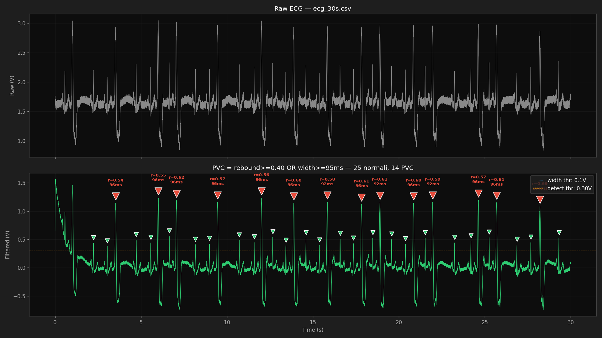

# holter-ecg

A DIY single-lead ECG built around a **Raspberry Pi Pico 2 W** and an **AD8232**
analog front-end, with a live Python dashboard on the host that filters,
detects R-peaks, and classifies premature ventricular contractions (PVCs) using
QRS width and post-QRS hyperpolarization rebound.

> ⚠️ **Educational project. Not a medical device.**
> This is a hobbyist exploration of human bioelectricity, built as a natural
> extension of a bioelectric recording project on plants. **Do not use this
> for diagnosis, monitoring of any clinical condition, or treatment decisions.**
> If you have a cardiac concern, see a cardiologist. The author of this repo
> is followed by one and built this purely out of curiosity about ECG signal
> processing and PVC morphology.



*30-second recording with bigeminy. Green markers = normal sinus beats; red
markers = PVCs, annotated with their measured rebound ratio and QRS width.*

---

## Why this project

After building a bioelectric signal pipeline on a houseplant (AD620 + ADS1115
+ Pi 5, low-frequency single-channel), I wanted to take the same architecture
toward human physiology. ECG is the obvious next step: same problem class
(membrane potentials of excitable cells), but with three crucial differences
that make the project pedagogically rich:

1. **Bandwidth**: plant signals are sub-Hz; ECG demands DC–40 Hz, with the QRS
   complex packing energy up to 25 Hz.
2. **Common-mode rejection**: a human body is a giant 50 Hz antenna, so a
   driven-right-leg loop is essential. The AD8232 provides this internally.
3. **Repeated stereotyped morphology**: instead of looking for slow deviations
   from baseline, you look for periodic pattern matches — opening the door to
   beat detection, classification, and rhythm analysis.

The classification angle is what makes this fun. I have benign but frequent
PVCs (clinically known and followed). I wanted to see whether a 12-line
detector could pick them out of the noise the way a clinician's eye does —
spoiler: yes, with the right features.

---

## Hardware

| Component | Notes |
| --- | --- |
| Raspberry Pi Pico 2 W (WH version) | RP2350, WiFi, 12-bit ADC. WH = pre-soldered headers. |
| AD8232 breakout board | Any clone of the SparkFun reference design works. Includes 3.5 mm jack for the electrode cable. |
| 3-lead ECG cable (3.5 mm TRS → snap connectors) | Usually included in AD8232 kits. |
| Disposable gel ECG electrodes ×3 | Standard adhesive snap electrodes (3M Red Dot or equivalent). |
| LiPo 3.7 V + TP4056 USB-C charger (optional) | For wireless / portable operation. A USB power bank works too. |
| Micro-USB cable | For programming and current host link. |

### Wiring (3 wires)

With the Pico 2 W held USB-up, the AD8232 connects to the **right column**
of the Pico header:

| AD8232 pin | Pico 2 W pin (physical) | Function |
| --- | --- | --- |
| `3.3V` | pin 36 (`3V3 OUT`) | Power |
| `GND` | pin 38 (`GND`) | Ground |
| `OUTPUT` | pin 31 (`GP26 / ADC0`) | ECG analog signal |

The electrode jack on the AD8232 takes the snap cable; `LO+`, `LO-`, and `SDN`
are not used in the simplest configuration.

**Electrode placement** (Einthoven Lead I, simplest 3-electrode setup):

```
                ── neck ──
       RA •                  • LA
      (red)                 (yellow)
   below R clavicle    below L clavicle

   ┌──────── chest ────────┐
   │                       │
   │      • RL/N           │
   │     (green)           │
   │   right lower flank   │
   └───────────────────────┘
```

⚠️ Always run the Pico from a **battery** (LiPo or USB power bank) when
electrodes are attached. Never connect a body to a device that is plugged into
mains-powered USB — leakage current is a real safety concern even at hobbyist
power levels.

---

## Architecture

```
[3 electrodes] → [AD8232 AFE] → analog ECG (0–3.3 V centered at ~1.55 V)
                                       │
                                       ▼
                            [Pico 2 W ADC0 @ 250 Hz]
                                       │
                            stdout (USB CDC serial)
                                       │
                                       ▼
                              [host: dashboard.py]
                       band-pass IIR → state-machine detector
                       → live plot + BPM + PVC classification
```

The current implementation streams over **USB serial** for simplicity. The
Pico 2 W has WiFi and the natural next step is to push samples over TCP to a
small server running on a separate Linux box (Pi 5 or similar), so the host
laptop can be turned off without interrupting recording. The code is already
structured so this only requires swapping the transport.

---

## Algorithm

### Filtering chain

Two first-order IIR filters in series on the host side:

| Stage | Cutoff | Purpose |
| --- | --- | --- |
| High-pass | 0.3 Hz | Removes DC offset and baseline wander from breathing |
| Low-pass | 25 Hz | Attenuates 50 Hz mains and high-frequency EMG noise |

Together they form a 0.3–25 Hz band-pass that preserves QRS morphology while
suppressing the dominant noise sources. First-order filters are intentionally
mild so that wide PVC complexes are not narrowed in the time domain.

### Beat detection: 4-state machine

```
   IDLE ──(v > WIDTH_THR)──▶ WIDTH ──(v > DETECT_THR)──▶ DETECT
     ▲                          │                          │
     │              (v drops, no detect_thr crossed)        │
     │                          ▼                          │
     │                       IDLE                          │
     │                                                     │
     └────────────────── POST ◀──(v < WIDTH_THR)───────────┘
              (monitor trough for 200 ms, then classify)
```

| Threshold | Default | Notes |
| --- | --- | --- |
| `WIDTH_THR` | 0.10 V | Low threshold used to **measure** QRS width at the base of the spike. |
| `DETECT_THR` | max(0.30, 0.45 × median amplitude) | High threshold required to **confirm** the up-crossing is a QRS and not a T-wave / noise spike. |
| `REFRACTORY` | 300 ms | Minimum interval between accepted R-peaks. |
| `POST_PEAK` | 200 ms | Time window monitored after each QRS to record the trough. |

Using two thresholds decouples *what counts as a QRS* (the high one) from
*how wide it is* (measured at the low one), giving width values that match
clinical references rather than being clipped by detection threshold.

### PVC classification: rebound + width

Each accepted beat is classified by two intrinsic features:

- **`width_ms`** — milliseconds the filtered signal stayed above `WIDTH_THR`.
- **`rebound_ratio`** — `|trough| / peak`, where `trough` is the minimum value
  of the filtered signal in the 200 ms following the peak. This captures the
  characteristic deep negative deflection (hyperpolarization-like undershoot)
  that follows a ventricular ectopic contraction.

A beat is classified as **PVC** when **either**:

- `rebound_ratio ≥ 0.40`, **or**
- `width_ms ≥ 95`

Otherwise it is **normal** (sinus origin).

On a real 30-second recording from the author (frequent PVCs in a bigeminy
pattern) the features separated cleanly:

| Feature | Normal beats | PVCs | Separation |
| --- | --- | --- | --- |
| Width | 28–44 ms (median 32) | 92–104 ms (median 96) | 48 ms gap |
| Rebound | 0.02–0.38 (median 0.25) | 0.54–0.69 (median 0.59) | 0.16 gap |
| Amplitude | 0.38–0.56 V (median 0.50) | 1.08–1.23 V (median 1.15) | 2.3× |

Rebound is the most discriminative single feature; width and amplitude follow.
Earlier iterations used amplitude alone, which has a positive-feedback failure
mode: if PVCs are excluded from the running baseline and amplitude drifts up,
all new beats can suddenly be labelled PVC and the baseline never recovers.
The current rule is intrinsic per-beat and history-free.

### Rate computation

Three rates are computed continuously on a rolling 60-second window:

- **ECG total BPM** = all detected beats / window — the apical (electrical) rate.
- **Sinus BPM** = normal beats only / window — approximately what a wrist PPG
  monitor (Garmin, Apple Watch) would report if it missed *all* PVCs.
- **PVC rate** = PVCs / minute — also the **pulse deficit lower bound**.
- **PVC burden %** = PVCs / total beats — clinically relevant ratio.

The difference between ECG total and sinus BPM is the **pulse deficit**
phenomenon: PVCs occur before full ventricular filling, produce reduced stroke
volume, and frequently fail to generate a palpable peripheral pulse. In one
of the author's recordings, a Garmin showed 58 BPM while the ECG dashboard
showed 78 BPM total / 50 BPM sinus — the Garmin was catching all normals and
about half of the PVCs.

---

## Quick start

### 1. Flash MicroPython on the Pico 2 W

Download the latest UF2 from <https://micropython.org/download/RPI_PICO2_W/>.
Hold BOOTSEL while plugging in USB, drag the UF2 onto the mounted `RP2350`
drive. The Pico reboots into MicroPython.

### 2. Install host dependencies

```bash
pip3 install --user mpremote matplotlib numpy
```

### 3. Wire up the AD8232 and attach electrodes

See [Wiring](#wiring-3-wires) and [Electrode placement](#hardware) above.
**Run the Pico from a battery / power bank when electrodes are attached.**

### 4. Run

```bash
git clone https://github.com/<your-username>/holter-ecg.git
cd holter-ecg
python3 host/dashboard.py
```

The dashboard auto-detects the Pico's USB serial device. Set `PICO_DEVICE=...`
in the environment to override.

### Dashboard keyboard shortcuts

- `space` — pause / resume live updates (lets you pan/zoom freely)
- `r` — reset axes to default view
- `↑` / `↓` — zoom Y in / out
- `←` / `→` — zoom X out / in

The matplotlib toolbar at the bottom also works for fine drag/zoom with mouse.

---

## Repository layout

```
holter-ecg/
├── pico/
│   └── streamer.py            # MicroPython, runs on the Pico; 250 Hz ADC → stdout
├── host/
│   ├── dashboard.py           # Live filter + detect + plot + classify
│   └── analyze_recording.py   # Offline analysis of recorded CSV with the same detector
├── tools/
│   ├── blink.py               # Sanity check that MicroPython is alive
│   ├── read_adc_raw.py        # Print raw ADC values (no filtering) — sanity check the wiring
│   ├── record_ecg.py          # Record 5 s of ECG and stream as CSV (early test)
│   ├── record_long.py         # Record 30 s with Pico-side timestamps for sample-rate verification
│   └── plot_ecg.py            # Plot a recorded CSV with no analysis
├── samples/
│   ├── ecg_take1.csv / .png   # First 5 s "hello QRS" capture
│   ├── ecg_30s.csv            # 30 s of frequent PVCs (bigeminy)
│   └── ecg_30s_rebound.png    # Annotated analysis output
├── README.md
├── LICENSE                    # MIT
└── .gitignore
```

To run any of the `tools/` recording scripts on the Pico:

```bash
mpremote connect /dev/cu.usbmodem... run tools/record_long.py > capture.csv
python3 host/analyze_recording.py capture.csv
```

---

## Roadmap

In rough order of personal interest, not deadlines:

- [ ] **WiFi streaming**: replace USB CDC with TCP over WiFi from Pico W to a
      lightweight server (Pi 5 in my case). Decouples the host laptop from
      continuous recording.
- [ ] **Persistent logging**: 24-hour holter-style continuous capture with
      CSV / HDF5 storage and offline review tooling.
- [ ] **HRV metrics**: SDNN, RMSSD, pNN50 computed on normal-to-normal RR
      intervals — opens the autonomic nervous system angle.
- [ ] **PAC distinction**: currently both PACs (narrow premature) and PVCs
      (wide premature) get classified by width / rebound; finer distinction
      would require P-wave detection.
- [ ] **Better filter**: move to a Pan-Tompkins-style 5–15 Hz QRS enhancement
      stage for the detector while keeping a wider band for display.
- [ ] **Wearable form factor**: smaller LiPo, 3D-printed enclosure with
      electrode breakout, the Pico running standalone with WiFi only.

---

## References and acknowledgements

- AD8232 datasheet — Analog Devices.
- Pan & Tompkins, "A Real-Time QRS Detection Algorithm",
  *IEEE Trans. Biomed. Eng.* 32(3):230–236, 1985.
- The SparkFun AD8232 hookup guide, which most Chinese-clone breakouts are
  electrically identical to.
- ProtoCentral, for keeping open-source biomedical hardware alive.

---

## License

MIT — see [LICENSE](LICENSE).
